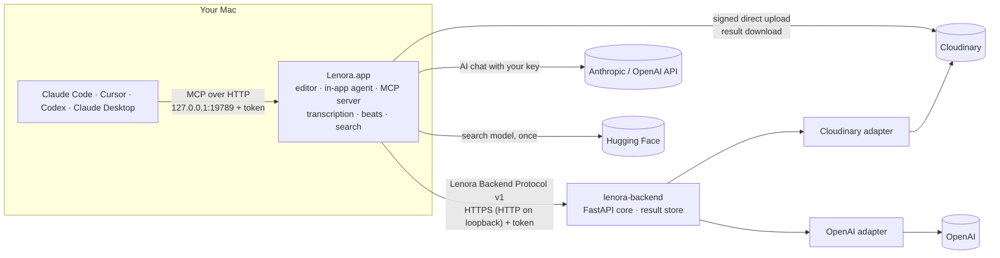

<p align="center"></p>

<h1 align="center">Lenora</h1>

An open-source, agent-native video editor for the Mac. Edit by hand, let the built-in agent edit with you, or let Claude Code, Cursor, Codex or Claude Desktop drive the timeline over MCP. Generative features run through a self-hosted, provider-neutral backend.

[](https://github.com/vermatushar/Lenora/actions/workflows/ci.yml)
[](LICENSE)
[](backend/LICENSE)


[](https://github.com/vermatushar/Lenora/blob/main/assets/this-is-lenora.mp4)

<p align="center"><a href="https://github.com/vermatushar/Lenora/blob/main/assets/this-is-lenora.mp4">▶ Watch the demo (24 s)</a></p>

**Cloudinary, Track 3:** [the product, the problem, and how to test it](CLOUDINARY.md).

## What Lenora is

Lenora is a native macOS editor written in Swift 6.2 with SwiftUI, AppKit, AVFoundation and Metal. Editing, playback, transcription, beat detection and footage search run on your Mac. No account is needed. Network services are used only by the features listed under [What leaves your Mac](#what-leaves-your-mac).

It is for editors who want an AI agent to work on the real timeline (cutting, captioning, grading, generating shots) with every change undoable, and for developers who want to host their own generation backend or add a provider to it.

Download the app as described below, or build it from source.

## Download and run

Requirements: a Mac with Apple silicon on macOS 26, and a free [Cloudinary](https://cloudinary.com/users/register_free) account. An OpenAI key (voiceover, Improve Prompt, agent) and an Anthropic key (agent on Claude) are optional.

1. Download `Lenora.dmg` from the [latest release](https://github.com/vermatushar/Lenora/releases/latest), open it, and drag **Lenora** to **Applications**. Launch it from Applications.
2. The app is not notarized, so macOS blocks the first launch. Open **System Settings → Privacy & Security**, scroll to Security, and choose **Open Anyway** next to Lenora.
3. Open **Lenora → Settings → API Keys**. In Cloudinary Console → **Settings → API Keys**, copy the **API environment variable** (`cloudinary://…`), paste it into **Paste API environment variable**, choose **Fill**, then **Save**. Add OpenAI or Anthropic keys if you have them.
4. **Settings → Backend** should say **Running on this Mac**, and list the `cloudinary` adapter as **Enabled**.

Lenora uses your own keys (bring your own key): requests go from your Mac to Cloudinary and OpenAI, and their usage is billed to your accounts. Keys are stored in the macOS Keychain.

| Key | Unlocks |
|---|---|
| Cloudinary | Background removal, generative fill and edits, upscaling, reframing, publish and share links |
| OpenAI | Voiceover, Improve Prompt, the in-app agent on OpenAI models |
| Anthropic | The in-app agent on Claude models |

Editing, playback, transcription, beat detection and footage search work without any key.

**Troubleshooting:** Saving a key restarts the built-in backend. If it fails to start, Settings → Backend shows why, with its **Log** and a **Restart** button. If macOS still refuses to open the app, run `xattr -dr com.apple.quarantine /Applications/Lenora.app` in Terminal.

## Features

### Editing
- Multi-track timeline with ripple, overwrite, split, slip, snapping, markers, linked audio, nested timelines and multicam.
- Keyframes for transform, crop, opacity and effects; picture-in-picture layouts, chroma key and mattes.
- Color: color wheels, curves, hue curves, LUTs and scopes.
- Text and captions: animated titles, caption presets, captions from transcripts, subtitle file import.
- Transcript editing: on-device transcription with Apple's Speech framework, remove words from the transcript, remove silence.
- Audio: waveforms, meters, audio sync between clips, beat detection with the bundled Beat This model, and on-device voice enhancement in builds with the `BundledSpeech` trait.
- Export to H.264, H.265, ProRes and HEVC 10-bit HDR, or hand off the timeline as FCPXML or XMEML (Final Cut Pro 7 XML, for Premiere Pro).

### Agent
- **In-app agent.** Chat with Claude or GPT models using your own Anthropic or OpenAI API key (Settings → API Keys). Keys are stored in the macOS Keychain and requests go straight to the provider's API.
- **One tool set.** The in-app agent and external MCP clients call the same tools (timeline reads, clip edits, multicam, transcript cuts, captions, color, effects, export, search, generation and publishing) through the same editor operations as the UI, and agent edits land in the same undo history as yours.
- **MCP server.** A Streamable HTTP MCP server bound to `127.0.0.1` (port 19789 by default) and protected by a bearer token. **Settings → Agent → Connect an agent** shows the token and a setup snippet for Claude Code, Cursor, Codex and Claude Desktop. Claude Desktop installs Lenora as an extension built from [`mcpb/`](mcpb/).
- **Skills.** 14 bundled [agent skills](app/Sources/Lenora/Resources/Skills/) for workflows such as color grading, multicam editing, captions and UGC ads. Settings → Skills installs them to `~/.lenora/skills/`, and the agent can save a timeline's approach as a new skill.

### Footage search
Search the media library by what is in the shot. Lenora samples frames and embeds them on device with SigLIP 2 converted to Core ML. The model ([`vermatushar/siglip2-base-coreml`](https://huggingface.co/vermatushar/siglip2-base-coreml)) is downloaded from Hugging Face on first use and checked against a SHA-256 hash. Turn search off in Settings → Storage.

### Generation (through the backend)
Generation features appear only when the connected backend advertises a model for them. Each adapter is enabled by adding its keys to the backend's environment.

| Adapter | What it adds |
|---|---|
| [Cloudinary](CLOUDINARY.md) ([adapter](backend/adapters/cloudinary/README.md)) | Background removal, generative edit (fill, replace, remove, recolor, background replace, restore), 4× upscale, video reframe, image generation and image-to-video (with those add-ons), image analysis, enhancement and smart crop from subscribed add-ons, and **Publish**: an HLS stream, download, poster, optional vertical cut (9:16, 1:1, 4:5) and 5–30 s teaser from one export, as signed, unlisted links. |
| [OpenAI](backend/adapters/openai/README.md) | Voiceover (`gpt-4o-mini-tts`, run as a background job) and **Improve Prompt**, which rewrites a prompt for video, image, speech or edit generation. |

Both adapters report an estimate per request, and each has an optional daily budget (Cloudinary credits, OpenAI USD) that refuses new jobs once the UTC day's estimates reach it. Settings → Backend shows which adapters are enabled, why a disabled one is off, and spend against each budget.

## How it works



- **The app** owns the project, undo history, UI, MCP server and in-app agent. It holds no provider secrets and has no provider-specific code: it learns which models exist from `GET /v1/capabilities`.
- **The protocol** ([`protocol/`](protocol/README.md)) is a hand-written OpenAPI 3.1 contract with shared fixtures. Uploads use direct-upload tickets, jobs are polled, retries are idempotent and errors are RFC 9457 problem documents.
- **The backend** ([`backend/`](backend/README.md)) authenticates requests, validates them and routes them to adapters discovered through Python entry points. Adapters that return bytes or text (OpenAI) store results for 24 hours and serve them from `/v1/results/{id}`; Cloudinary returns signed delivery URLs.
- **Adding a provider** means copying [`backend/adapters/_template`](backend/adapters/_template/README.md) and passing its conformance suite. The editor needs no change.

### What leaves your Mac

| When | What is sent | To |
|---|---|---|
| You run a generation, analysis or publish | The source media and parameters | Your backend, and the media straight to Cloudinary through a signed upload ticket |
| You request a voiceover or Improve Prompt | The script or prompt | Your backend, then OpenAI |
| You chat with the in-app agent | Messages, tool results and frames the agent inspects | Anthropic or OpenAI, with your key |
| You first use footage search | A download request only | Hugging Face |

Editing, transcription, beat detection, search indexing and export stay local. The MCP server accepts only local connections. Provider keys live in the macOS Keychain for the built-in backend, or in a self-hosted backend's environment (`.env` in development); the backend token, MCP token and chat keys live in the macOS Keychain. Published links are public to anyone who has them.

## Requirements

- macOS 26 on Apple silicon
- Xcode 26 with the Metal toolchain (`xcodebuild -downloadComponent MetalToolchain`)
- [uv](https://docs.astral.sh/uv/) for the backend (bootstrap offers to install it); uv provides Python 3.12
- Node.js only to run the localization scripts
- Docker, optionally, to run the backend as a container

## Quick start

```bash
git clone https://github.com/vermatushar/Lenora.git
cd Lenora
./scripts/bootstrap
./scripts/dev
```

`bootstrap` checks the platform and toolchain, syncs the backend, creates `.env` from [`.env.example`](.env.example) with a generated `LENORA_TOKEN`, builds the app and prints each adapter's status. It is safe to re-run.

`dev` starts the backend on `127.0.0.1:8787`, assembles `app/.build/Lenora.app` and launches it already connected to the backend. The editor never inherits the provider keys in `.env`. Ctrl-C stops both.

Editing works with no keys. To turn on generation, fill in `.env` and restart `./scripts/dev`:

| Variables | Enable |
|---|---|
| `LENORA_CLOUDINARY_CLOUD_NAME`, `LENORA_CLOUDINARY_API_KEY`, `LENORA_CLOUDINARY_API_SECRET` | The Cloudinary adapter |
| `LENORA_OPENAI_API_KEY` (or `OPENAI_API_KEY`) | The OpenAI adapter |

### Build the app on its own

```bash
cd app
swift build
swift run
```

From the repository root, `scripts/bundle.sh debug --fast` assembles an ad-hoc signed `app/.build/Lenora.app`. Add `--speech` to include the `BundledSpeech` trait (on-device speech models and MLX).

### Run the backend on its own

For development and self-hosting, run the backend yourself and point the app at it with **Settings → Backend → Custom URL**.

```bash
cd backend
uv sync
uv run lenora-backend          # reads ../.env in development
```

Then open **Settings → Backend** in Lenora, choose **Custom URL**, enter the URL and paste `LENORA_TOKEN`, and choose **Test Connection**. Remote backends must use HTTPS.

### Run the backend in Docker

```bash
docker build -t lenora-backend backend
docker run --rm -p 8080:8080 -v lenora-data:/data \
  -e LENORA_TOKEN -e LENORA_CLOUDINARY_CLOUD_NAME -e LENORA_CLOUDINARY_API_KEY \
  -e LENORA_CLOUDINARY_API_SECRET -e LENORA_OPENAI_API_KEY \
  lenora-backend
```

Export the variables in your shell first. The image runs in production mode on port 8080 and keeps job state, learned add-on state and stored results in `/data`. Run a single instance. It sets `LENORA_FORWARDED_ALLOW_IPS=*` so result URLs keep `https` behind a TLS-terminating proxy; narrow it if the container is reachable without the proxy. See [Deploy](backend/README.md#deploy).

## Configuration

[`.env.example`](.env.example) documents every variable, and [`backend/README.md`](backend/README.md#configuration) lists defaults. Each adapter README covers its own settings, costs and limits. An adapter with missing settings is disabled, and `GET /v1/health` (with the token) says why.

## Testing

```bash
(cd app && swift test)                                    # editor
(cd backend && uv run pytest)                             # backend: unit, contract, conformance (mocked)
uvx --with pytest pytest scripts -q                       # repository scripts
uv run --no-project --python 3.12 scripts/rebrand.py --check --check-vendors
node scripts/localization/check.mjs                       # localization catalogs
```

Run them from the repository root. Live tests call real providers with your keys and cost money, so they are opt-in: `cd backend && uv run pytest -m live`. The OpenAI live suite costs about $0.02 per run.

CI runs the backend tests, script tests and rebrand check on every pull request. The macOS build and test job does not block yet.

## Project structure

| Path | Contents | License |
|---|---|---|
| [`app/`](app/) | Swift package `Lenora`: editor, MCP server, in-app agent and tests | GPLv3 |
| [`backend/`](backend/) | `lenora-backend` (FastAPI core) and its adapters | Apache-2.0 |
| [`protocol/`](protocol/) | Lenora Backend Protocol v1: `openapi.yaml` and fixtures | Apache-2.0 |
| [`skills/`](app/Sources/Lenora/Resources/Skills/) | Bundled agent skills (symlink to `app/Sources/Lenora/Resources/Skills`) | Apache-2.0 |
| [`mcpb/`](mcpb/) | Claude Desktop extension: a stdio-to-HTTP bridge to the app's MCP server | |
| [`scripts/`](scripts/) | `bootstrap`, `dev`, `bundle.sh`, `rebrand.py`, localization tools | |
| [`assets/`](assets/) | README logo and demo video | |

## Localization

The editor ships in English and 27 other languages. Catalogs live in [`app/Sources/Lenora/Resources/Localization/`](app/Sources/Lenora/Resources/Localization/), one `<locale>.lproj` directory each, with `Localizable.strings` and `InfoPlist.strings`.

- Change UI copy with `L10n.string`, then run `scripts/localization/sync.sh`. It regenerates `en.lproj/Localizable.strings`, the source inventory; do not edit that file by hand.
- To add a language, add one complete `<locale>.lproj` directory with both files. Translate values, never keys, and keep placeholders intact. No code change is needed.
- `node scripts/localization/check.mjs --require-complete` must pass for a language pull request.

## Contributing

Read [CONTRIBUTING.md](CONTRIBUTING.md), and [`app/AGENTS.md`](app/AGENTS.md) before changing the editor. Bugs and feature requests go in [issues](https://github.com/vermatushar/Lenora/issues). Participation is governed by the [Code of Conduct](CODE_OF_CONDUCT.md).

## Security

Report vulnerabilities privately as described in [SECURITY.md](SECURITY.md). Do not open a public issue.

## License and attribution

Lenora uses two licenses; see [NOTICE](NOTICE).

- The editor in `app/` is distributed under the [GNU General Public License v3.0](LICENSE). Upstream copyright and modification notices are in [NOTICE](NOTICE).
- [`backend/`](backend/LICENSE), [`protocol/`](protocol/LICENSE) and [`skills/`](app/Sources/Lenora/Resources/Skills/LICENSE) are licensed under the Apache License 2.0.
- The footage search model is converted from [google/siglip2-base-patch16-256](https://huggingface.co/google/siglip2-base-patch16-256) (Apache-2.0).
- The beat-tracking model is converted from [Beat This](https://github.com/CPJKU/beat_this) (MIT, © 2024 Institute of Computational Perception, JKU Linz).

Cloudinary, OpenAI, Anthropic, Claude, Cursor, Codex and other product names and logos are trademarks of their respective owners. Lenora is not affiliated with or endorsed by them.

## Acknowledgements

Lenora builds on the [MCP Swift SDK](https://github.com/modelcontextprotocol/swift-sdk), [swift-transformers](https://github.com/huggingface/swift-transformers), [MLX Swift](https://github.com/ml-explore/mlx-swift), [Lottie](https://github.com/airbnb/lottie-ios) and [speech-swift](https://github.com/soniqo/speech-swift).
